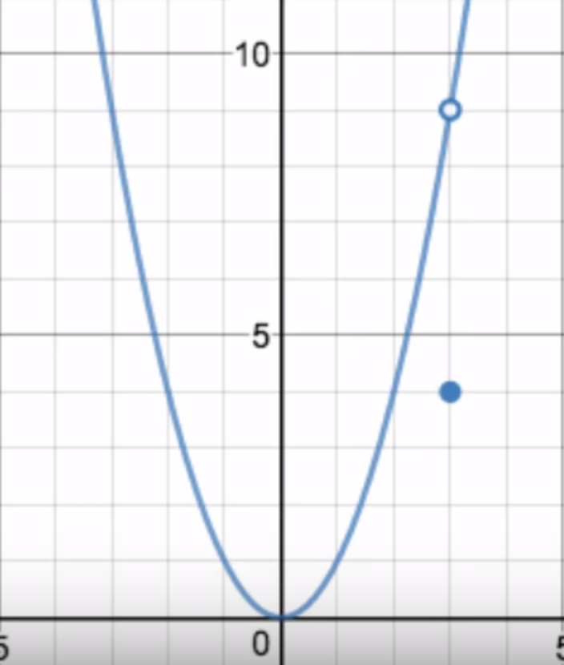
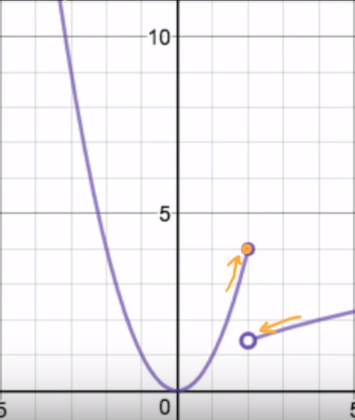
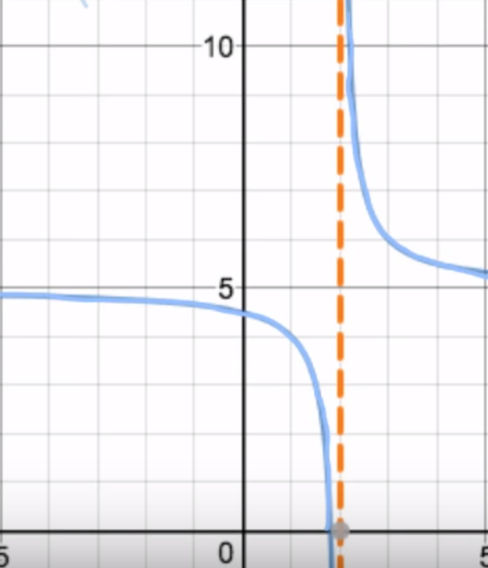

# Calculus

This repository was made during my personal preparation for the "Computer Science and Artificial Intelligence BSc (Hons)" at the university of Sussex.

# Definition
Calculus is the mathematical study of **continuous change**, in the same way that geometry is the study of shape and algebra is the study of generalizations of arithmetic operations.

It has two major branches, **differential calculus** and **integral calculus**.
- **Differential calculus** concerns instantaneous rates of change and the slopes of curves.
- **Integral calculus** concerns accumulation of quantities and the areas under and between curves.

These two branches are related to each other by the fundamental theorem of calculus. Both branches make use of the fundamental notions of convergence of infinite sequences and infinite series to a well-defined limit.
*(wikipedia)*

# Differential calculus
## Limits

## Continuity and Discontinuity
| Point / Removable discontinuity                             | Jump Discontinuity                             | Asymptotic / Infinite Discontinuity                             |
|:----------------------------------------------------------- |:---------------------------------------------- | --------------------------------------------------------------- |
|  |  |  |
| Limits from left to right are equals.                                                            |  Limits from left to right exist but are not equals.                                               | Limits from left and right are infinite *(negative or positive)*                                                                |

*There is also a fourth discontinuity called "Ugly Discontinuity" but we will not talk about it here.*

[video](https://www.khanacademy.org/math/ap-calculus-ab/ab-limits-new/ab-1-10/v/types-of-discontinuities?modal=1)

# 
